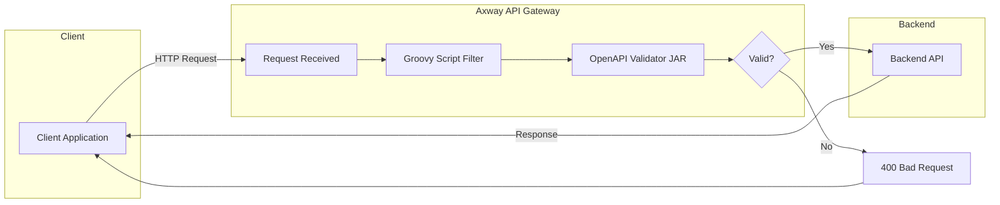
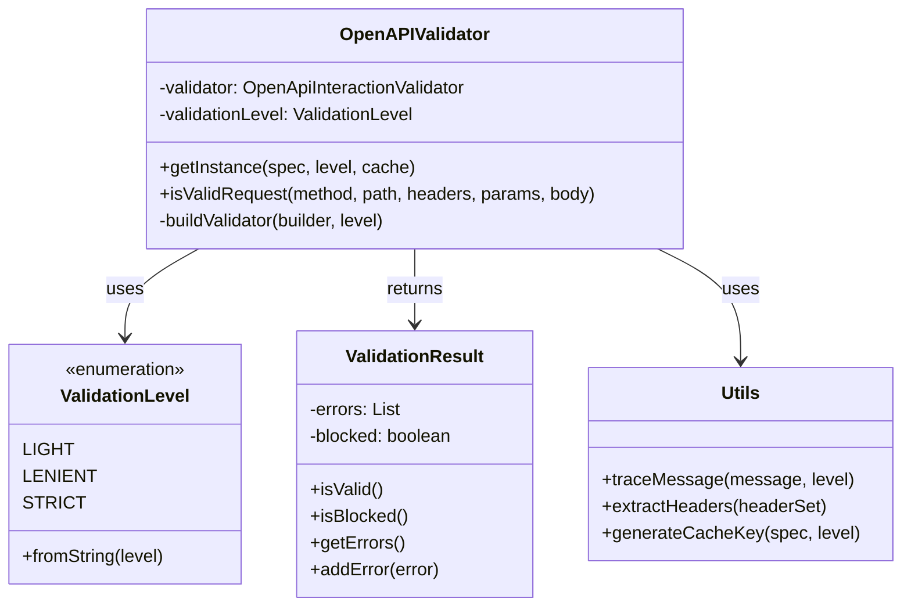
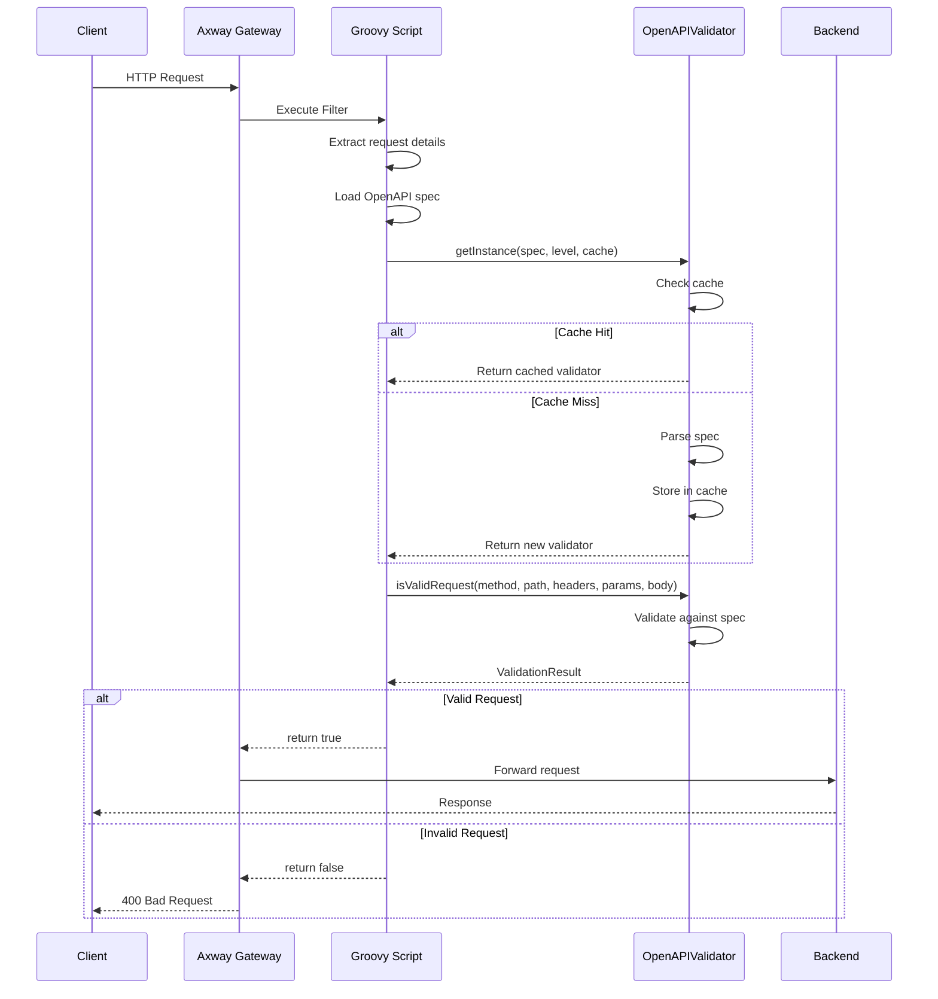
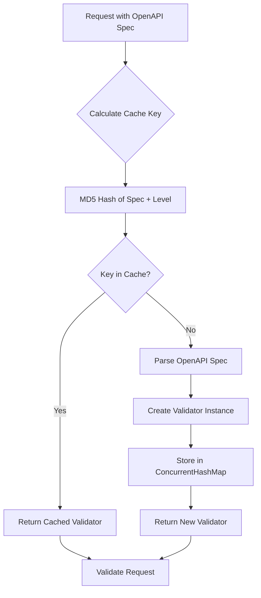
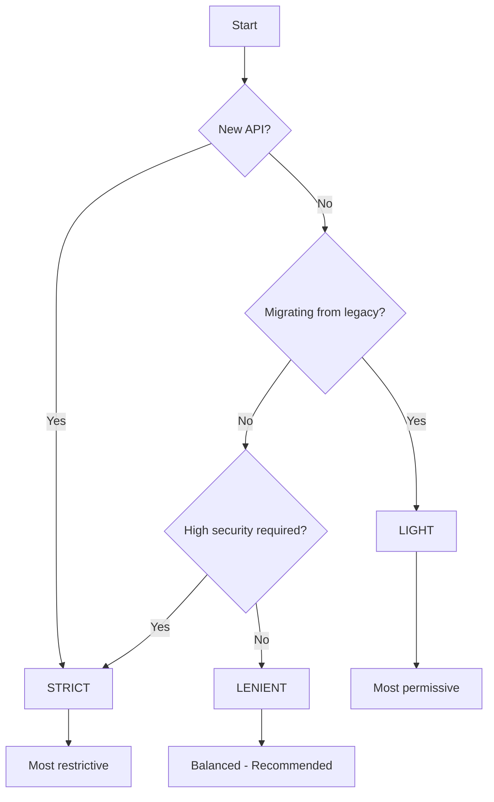
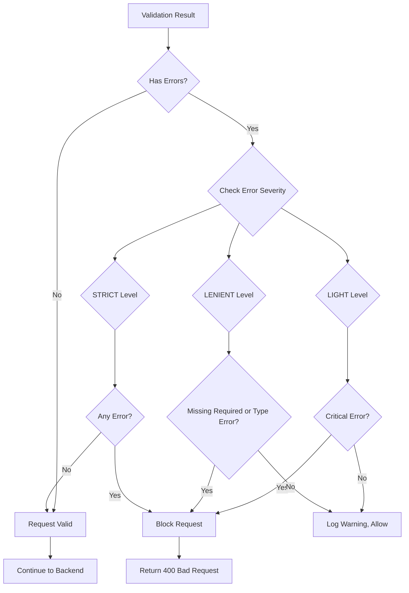
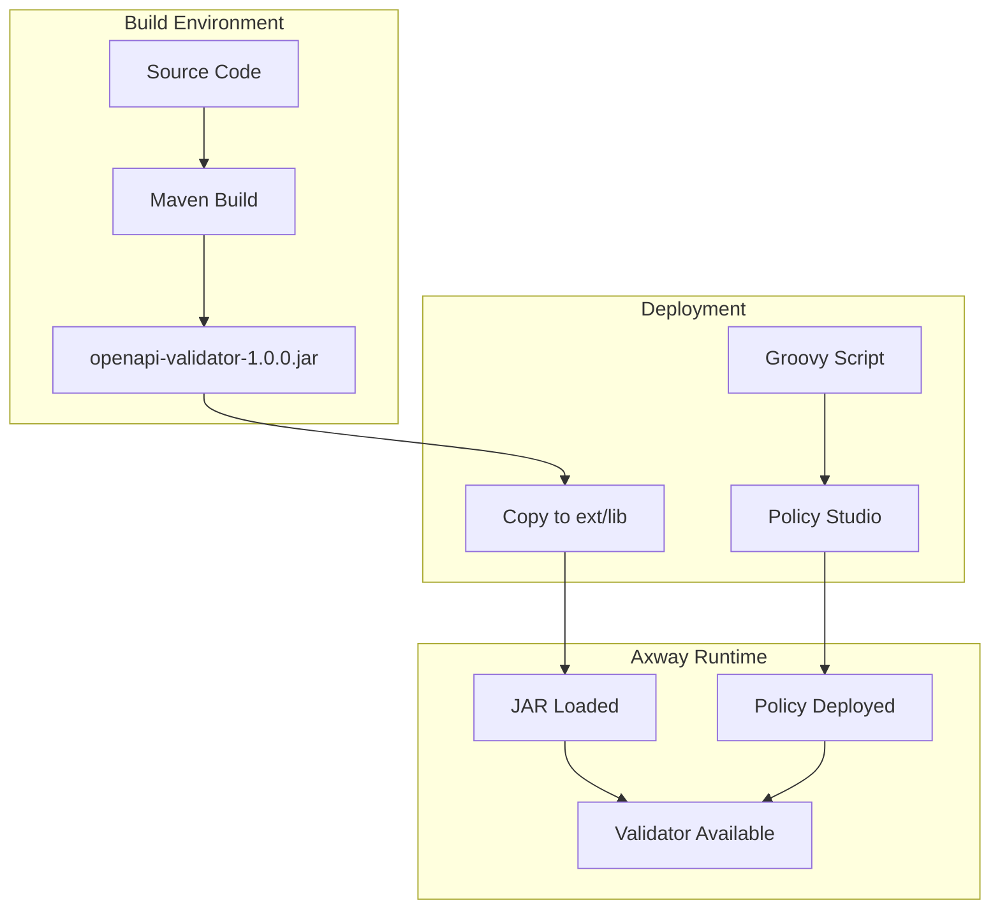

# Architecture Diagrams

These diagrams can be rendered using [Mermaid Live Editor](https://mermaid.live) or any Mermaid-compatible viewer.

---

## 1. High-Level Architecture



---

## 2. Component Diagram



---

## 3. Request Validation Flow



---

## 4. Caching Mechanism



---

## 5. Validation Level Decision Tree



---

## 6. Validation Levels Comparison

```mermaid
graph LR
    subgraph LIGHT
        L1[Basic path check]
        L2[Method validation]
        L3[Warnings only]
    end

    subgraph LENIENT
        M1[Path check]
        M2[Method validation]
        M3[Required fields]
        M4[Type checking]
        M5[Extra props OK]
    end

    subgraph STRICT
        S1[Path check]
        S2[Method validation]
        S3[Required fields]
        S4[Type checking]
        S5[No extra props]
        S6[All constraints]
    end

    LIGHT -.->|More strict| LENIENT
    LENIENT -.->|More strict| STRICT
```



---

## 7. Error Handling Flow



---

## 8. Deployment Architecture



---

## How to Export These Diagrams

### Option 1: Mermaid Live Editor
1. Go to [mermaid.live](https://mermaid.live)
2. Copy the Mermaid code (between ```mermaid and ```)
3. Paste in the editor
4. Download as PNG or SVG

### Option 2: VS Code Extension
1. Install "Mermaid Preview" extension
2. Open this file
3. Use preview to see rendered diagrams
4. Export as needed

### Option 3: GitHub
GitHub automatically renders Mermaid diagrams in markdown files.

---

## Diagram Export Checklist

- [ ] High-Level Architecture → `architecture-overview.png`
- [ ] Component Diagram → `component-diagram.png`
- [ ] Request Validation Flow → `validation-flow.png`
- [ ] Caching Mechanism → `caching-mechanism.png`
- [ ] Validation Level Decision Tree → `level-decision.png`
- [ ] Validation Levels Comparison → `levels-comparison.png`
- [ ] Error Handling Flow → `error-handling.png`
- [ ] Deployment Architecture → `deployment.png`
